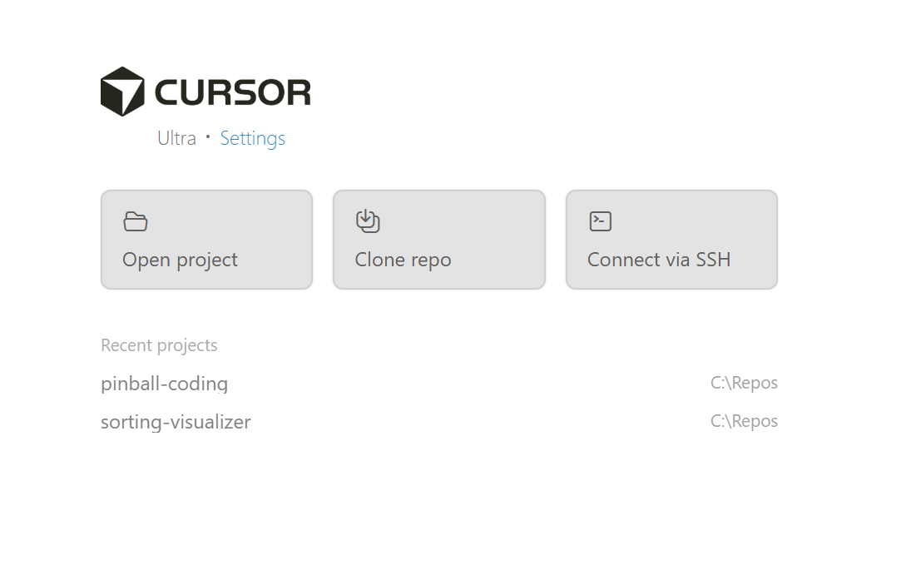
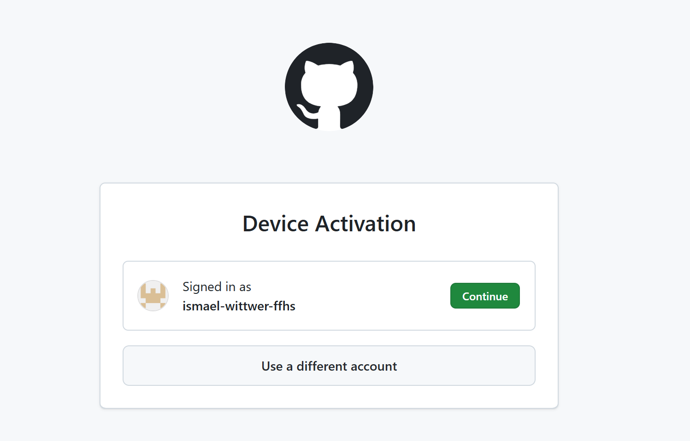
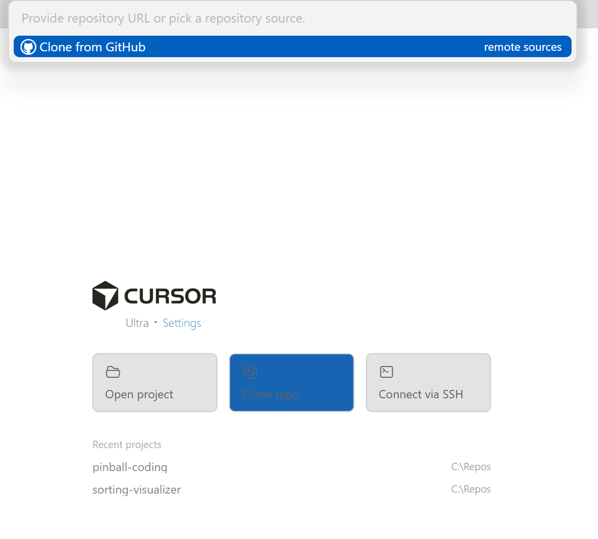
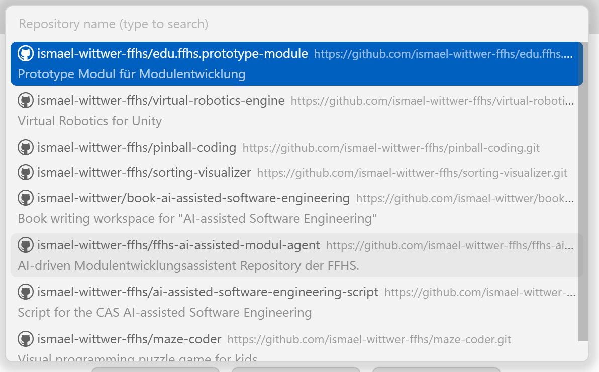
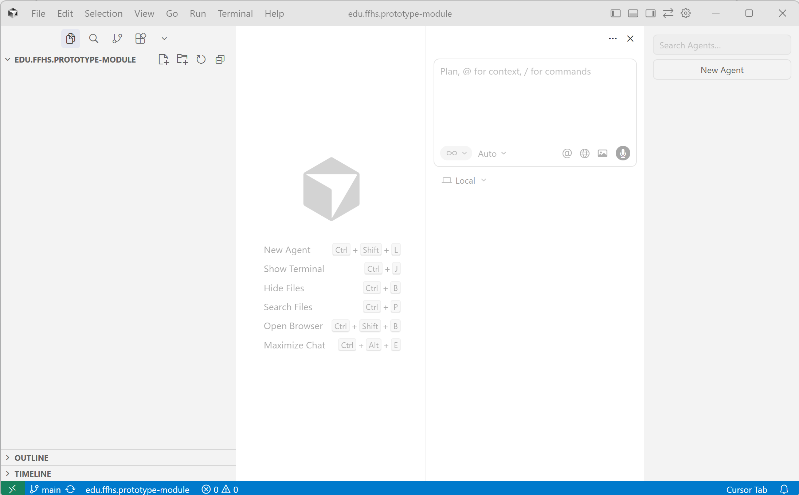
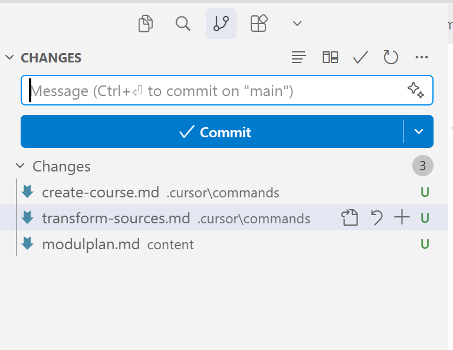
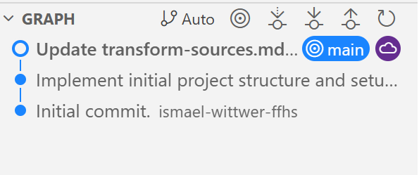
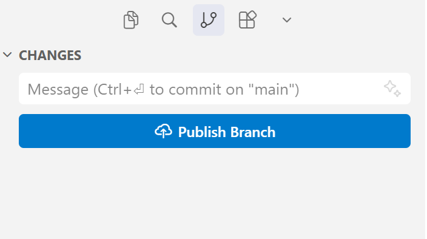
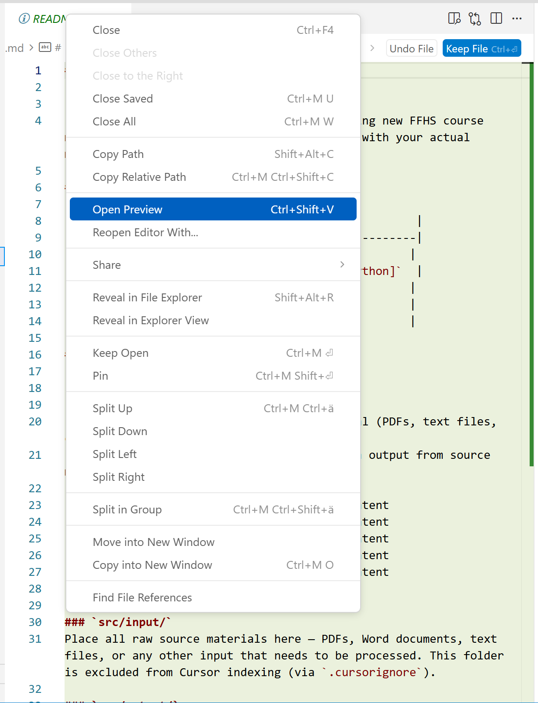

# Anleitung: Arbeiten mit dem FFHS-Modul-Template in Cursor

## Einrichtung

### 1. Cursor herunterladen und installieren

1. Öffne [cursor.sh](https://cursor.sh/) und lade den Installer für Windows herunter.
2. Starte die Installation (Standard-Optionen sind in der Regel okay).
3. Öffne Cursor nach der Installation.



### 2. Cursor-Account erstellen / anmelden

1. In Cursor: Settings öffnen (oder beim Start-Flow **Sign in** wählen).
2. Mit E-Mail oder über einen Provider anmelden.
3. Wenn Cursor eine Browser-Weiterleitung macht: im Browser einloggen und bestätigen.

**Tipp:** Wenn du GitHub zum Klonen nutzt, ist es am einfachsten, die Anmeldung direkt über GitHub zu machen (siehe Schritt 5). Dann bist du danach in Cursor automatisch verbunden.

### 3. Git für Windows installieren

1. Lade [Git for Windows](https://git-scm.com/download/win) herunter.
2. Installer starten. Empfohlene Auswahl:
   - *Use Git from the command line and also from 3rd-party software*
   - *Use bundled OpenSSH*
   - Standard-Editor kann so bleiben (oder Cursor wählen, wenn angeboten)
3. Kurztest — öffne PowerShell (oder das Terminal in Cursor) und prüfe:

```
git --version
```

Wenn eine Versionsnummer erscheint, ist Git korrekt installiert.

### 4. Optional: GitHub-Account erstellen

Falls du noch keinen GitHub-Account hast:

1. Auf [github.com](https://github.com/) registrieren (E-Mail bestätigen).
2. Optional: 2FA aktivieren.
3. Repo-Zugriff sicherstellen (bei privaten Repos ggf. Einladung annehmen).

### 5. Cursor mit GitHub verbinden

Beim ersten GitHub-Login kann ein **Device Activation**-Dialog erscheinen (Browser-Fenster). Das ist normal.



1. Klicke **Continue**.
2. Bestätige im Browser (GitHub) die Verbindung.
3. Danach kehrst du zu Cursor zurück.

### 6. Repository klonen

**Variante A: Aus Cursor heraus klonen (empfohlen)**

1. Cursor öffnen.
2. Auf **Clone repo** klicken.



3. **Clone from GitHub** wählen.
4. Falls du noch nicht verbunden bist, wirst du zur GitHub-Anmeldung/Device Activation geführt (siehe Schritt 5).
5. Repository aus der Liste auswählen.



6. Zielordner auswählen (z. B. `C:\Repos`).
7. Cursor öffnet danach automatisch das Projekt.



**Variante B: Repo-URL einfügen**

1. **Clone repo** klicken.
2. Repo-URL einfügen (HTTPS oder SSH).
3. Zielordner wählen.

---

## Schnellstart

1. Repository öffnen: **File → Open Folder** → Projektordner auswählen.
2. `README.md` öffnen und alle `[Platzhalter]` mit den tatsächlichen Modulangaben ersetzen.
3. `content/modulplan.md` mit der Modulstruktur befüllen — dieses Dokument steuert alles Weitere.
4. Quellmaterial in `src/input/` ablegen.
5. Cursor-Commands nutzen, um Quellen zu transformieren und Kursinhalte zu generieren.

---

## Projektstruktur

```
├── .cursor/
│   ├── commands/          # Cursor-Commands (wiederverwendbare Prompts)
│   └── rules/             # Project Rules (KI-Verhaltensregeln)
├── src/
│   ├── input/             # Rohes Quellmaterial (PDFs, DOCX usw.)
│   └── output/            # Verarbeitetes Markdown aus dem Quellmaterial
├── content/
│   ├── block-1/ bis block-5/  # Finale Kursinhalte pro Block
│   ├── exams/             # Prüfungs- und Bewertungsmaterial
│   └── modulplan.md       # Massgebliches Dokument für die Modulstruktur
├── scripts/               # Hilfsskripte
├── README.md              # Modulübersicht
└── ANLEITUNG.md           # Diese Datei
```

### Was gehört wohin?

| Material | Zielordner | Hinweise |
|---|---|---|
| PDFs, DOCX, Rohtexte | `src/input/` | Wird von Cursor nicht indexiert (via `.cursorignore`) |
| Transformierte Markdown-Quellen | `src/output/` | Erzeugt durch den Command *Transform Sources* |
| Modulplan | `content/modulplan.md` | Immer zuerst befüllen — steuert die Blockstruktur |
| Block-Inhalte (Lernziele, Aufgaben) | `content/block-N/block-N.md` | Erzeugt durch den Command *Moodle-Kurs erstellen* |
| Ergänzende Block-Dateien | `content/block-N/01-titel.md` | Kebab-Case, zweistelliges Präfix |
| Prüfungen | `content/exams/` | — |
| Hilfsskripte | `scripts/` | — |

---

## Cursor-Commands ausführen

Commands sind vordefinierte Prompts, die im Ordner `.cursor/commands/` liegen.

### Verfügbare Commands

| Command-Datei | Zweck |
|---|---|
| `transform-sources.md` | Transformiert Rohmaterial aus `src/input/` in Markdown unter `src/output/` |
| `create-course.md` | Erzeugt die Moodle-Kursstruktur (Block-Dateien) basierend auf Modulplan und Quellen |

### So führst du einen Command aus

1. Öffne den Cursor-Chat (Tastenkürzel: `Ctrl+L`).
2. Tippe `/` im Chatfeld — es erscheint eine Liste der verfügbaren Commands.
3. Wähle den gewünschten Command aus (z. B. *Transform Sources*).
4. Der Command-Prompt wird automatisch in den Chat geladen. Bestätige mit Enter.
5. Cursor führt die Anweisungen aus dem Command aus.

### Typischer Workflow

```
1. Quellmaterial in src/input/ ablegen
2. Command "Transform Sources" ausführen     → erzeugt src/output/
3. content/modulplan.md befüllen
4. Command "Moodle-Kurs erstellen" ausführen  → erzeugt content/block-N/block-N.md
5. Inhalte manuell prüfen und verfeinern
```

---

## Project Rules anpassen

Project Rules steuern das Verhalten der KI in diesem Projekt.
Sie liegen unter `.cursor/rules/` als `.mdc`-Dateien.

### Vorhandene Regeln

| Datei | Zweck | Geltungsbereich |
|---|---|---|
| `persona.mdc` | Ton, Stil, Sprachregeln | Immer aktiv |
| `working-mode.mdc` | Arbeitsmodus (Planung, Sicherheit, Kommunikation) | Immer aktiv |
| `project-structure.mdc` | Ordnerstruktur, Dateikonventionen, Transformationsregeln | Immer aktiv |
| `content-authoring.mdc` | Didaktische Grundsätze, Formatierung, Dateinamen | Aktiv bei Dateien unter `content/` |

### Wichtig: Regeln nicht eigenständig ändern

Die Project Rules werden zentral durch das **Learning Center (LC)** gepflegt.
Modulentwickler dürfen die Dateien unter `.cursor/rules/` **nicht** eigenständig bearbeiten, umbenennen oder löschen.
Änderungswünsche an den Regeln sind an das LC zu richten.

### Aufbau einer Regel (Referenz)

Jede `.mdc`-Datei hat einen YAML-Frontmatter, der das Verhalten steuert:

```yaml
---
description: Kurzbeschreibung der Regel
alwaysApply: true       # true = immer aktiv, false = nur bei passenden Dateien
globs: content/**       # Optional: Dateimuster, bei denen die Regel gilt
---
```

Der Inhalt darunter ist Markdown und wird von Cursor als Anweisung an die KI übergeben.

---

## Neue Commands erstellen

1. Erstelle eine neue `.md`-Datei unter `.cursor/commands/`.
2. Der Dateiname wird zum Command-Namen (Kebab-Case empfohlen).
3. Schreibe die Anweisungen in Markdown — diese werden als Prompt an die KI übergeben.
4. Der Command erscheint danach in der `/`-Befehlsliste im Chat.

---

## Git-Workflow

### Konventionen

- **Kebab-Case** für alle Datei- und Ordnernamen.
- `src/input/` wird via `.cursorignore` von der Indexierung ausgeschlossen, ist aber im Git-Repository enthalten.
- `.gitkeep`-Dateien halten leere Ordner im Repository — nicht löschen.

### Änderungen committen (Source-Control-Tab)

Cursor enthält die Git-Integration von VS Code. Alle Git-Operationen lassen sich direkt über die grafische Oberfläche erledigen — ohne Terminal.

1. **Source Control öffnen:** Klicke auf das Branch-Symbol in der linken Seitenleiste oder nutze `Ctrl+Shift+G`.
2. **Änderungen prüfen:** Unter *Changes* siehst du alle geänderten, neuen und gelöschten Dateien. Ein Klick auf eine Datei zeigt den Diff (Vorher/Nachher).
3. **Dateien stagen:**
   - Einzelne Datei stagen: Fahre mit der Maus über die Datei und klicke das `+`-Symbol.
   - Alle Dateien stagen: Klicke das `+`-Symbol neben der Überschrift *Changes*.
   - Gestagete Dateien erscheinen unter *Staged Changes*. Zum Entstagen das `−`-Symbol klicken.
4. **Committen:** Schreibe eine aussagekräftige Nachricht ins Textfeld oberhalb der Dateiliste und klicke den **Commit**-Button (Häkchen-Symbol) oder drücke `Ctrl+Enter`. Alternativ: Klicke den Pfeil neben dem Commit-Button und wähle **Generate Commit Message with AI** — Cursor erstellt dann automatisch eine Commit-Nachricht basierend auf den gestageten Änderungen.
5. **Pushen:** Nach dem Commit erscheint ein **Sync Changes**-Button (oder das Cloud-Symbol in der Statusleiste unten). Damit werden die Commits zum Remote gepusht.

**Weitere nützliche Funktionen im Source-Control-Tab:**

- **Branch wechseln/erstellen:** Klick auf den Branch-Namen in der Statusleiste (unten links).
- **Pull:** Über das Drei-Punkte-Menü (`···`) im Source-Control-Tab → *Pull*.
- **Stash:** Über das Drei-Punkte-Menü → *Stash* — legt aktuelle, nicht committete Änderungen auf einen Stapel und stellt den letzten sauberen Stand wieder her. Nützlich, wenn man z. B. kurz den Branch wechseln muss, ohne die laufende Arbeit zu committen. Über *Pop Stash* lassen sich die Änderungen danach wiederherstellen.
- **Commit History:** Cursor zeigt unter *Timeline* (im Explorer-Tab, unterhalb der Dateiliste) die Commit-Historie der aktuell geöffneten Datei.





### Wenn «Publish Branch» erscheint

Das passiert, wenn du lokal ein neues Repo gestartet hast, aber noch kein Remote verknüpft ist.



1. Klicke **Publish Branch**.
2. Cursor verbindet das Repo mit GitHub und pusht den aktuellen Stand.
3. Danach kannst du normal Pull/Push/Sync nutzen.

### Empfohlene Commit-Struktur

| Änderungstyp | Beispiel-Commit-Nachricht |
|---|---|
| Modulplan erstellt | `Modulplan mit 5 Blöcken definiert` |
| Quellen transformiert | `Quellmaterial Kapitel 1–3 nach src/output transformiert` |
| Block-Inhalte erstellt | `Block 2: Kursstruktur mit Lernzielen und Aufgaben erstellt` |
| Prüfung hinzugefügt | `Schlussprüfung mit 40 MC-Fragen erstellt` |
| Regel angepasst | `Project Rule: Zeitbudget pro Block auf 25h angepasst` |

### Hinweis zu `src/input/`

Die Dateien in `src/input/` sind via `.cursorignore` von der Cursor-Indexierung ausgeschlossen.
Sie werden also von der KI nicht gelesen und nicht in Suchergebnissen berücksichtigt.
Im Git-Repository sind sie aber weiterhin enthalten und werden normal committet.

---

## Änderungen annehmen oder ablehnen

Wenn Cursor Dateien bearbeitet, werden die Änderungen nicht sofort übernommen — du behältst die Kontrolle.

### Im Editor (Inline-Diff)

Nach einer KI-Bearbeitung zeigt Cursor die Änderungen als farbigen Diff direkt in der Datei an (grün = neu, rot = entfernt).

- **Einzelne Änderung annehmen:** Klicke auf **Accept** neben dem jeweiligen Diff-Block.
- **Einzelne Änderung ablehnen:** Klicke auf **Reject** — die Datei bleibt im Originalzustand.
- **Alle Änderungen annehmen:** Klicke auf **Accept All** in der Toolbar oberhalb des Editors oder nutze `Ctrl+Shift+Enter`.
- **Alle Änderungen ablehnen:** Klicke auf **Reject All** oder nutze `Ctrl+Shift+Backspace`.

### In der Dateiliste (mehrere Dateien)

Hat Cursor mehrere Dateien gleichzeitig bearbeitet, erscheint in der oberen Leiste eine Übersicht aller betroffenen Dateien. Du kannst dort mit den Pfeiltasten zwischen den Dateien navigieren und jede einzeln prüfen, bevor du annimmst oder ablehnst.

### Rückgängig machen

Hast du eine Änderung bereits angenommen, kannst du sie über `Ctrl+Z` (Undo) im jeweiligen Editor rückgängig machen, solange die Datei noch offen ist.

---

## Tipps für die Arbeit mit Cursor

- **Chat-Kontext einschränken:** Verwende `@`-Referenzen, um Cursor auf bestimmte Dateien oder Ordner zu lenken (z. B. `@content/modulplan.md`).
- **Schrittweise arbeiten:** Erst Modulplan, dann Quellen transformieren, dann Blöcke generieren. Nicht alles auf einmal.
- **Ergebnisse prüfen:** Die KI erfindet keine Inhalte (so konfiguriert), kann aber Formatierungsfehler machen. Immer gegenlesen.
- **Regeln iterativ verfeinern:** Wenn die KI wiederholt etwas falsch macht, eine passende Project Rule ergänzen (Änderungen an Rules nur über das LC).
- **Markdown-Vorschau:** Öffne eine `.md`-Datei (z. B. `README.md` oder `modulplan.md`), dann Rechtsklick im Editor → **Open Preview**. Die Vorschau zeigt das gerenderte Markdown neben dem Quelltext.


